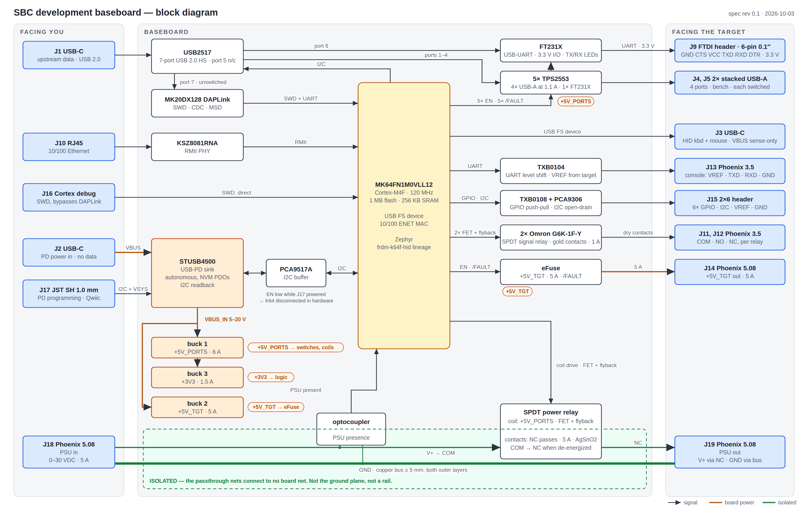

# sbc-development-baseboard

One board carrying the hardware you need to develop on and remotely manage an
attached single-board computer: a microcontroller that is a USB device to the
target and a console to you, four individually switched USB-A ports, an FTDI
header straight to the workstation, two isolated
SPDT relays on screw terminals, a level-shifted serial console, and a switched
supply for the target itself.

It replaces a bench that currently takes an FRDM-K64F, a QT Py, an 8-channel
relay board, a two-tier USB hub cascade and a CP2102N dongle, wired together by
hand and documented in a port map that has to be re-surveyed whenever anything
is replugged.

## What it does

| Function | How |
|---|---|
| Type at the target | USB HID keyboard + mouse from the K64's device port |
| Cut power to any USB device | Four USB-A ports on two stacked receptacles, each with its own current-limited switch |
| Hard power-cycle the target | Switched +5V_TGT rail up to 5 A, or any PSU up to 30 V / 5 A through an isolated relay |
| Toggle target I/O — FORCE_RECOVERY and friends | Two SPDT relays, dry contacts, Phoenix terminals |
| Read the target's serial console | MCU-owned UART, auto level translation 1.2–3.6 V |
| Read it from the workstation directly | FT231X on an internal hub port, standard 6-pin FTDI header, 3.3 V |
| Do all of it from somewhere else | 10/100 Ethernet to the workstation |
| Do all of it with no network | USB CDC console over the onboard DAPLink |

Every one of those is addressable from the same ASCII protocol the relay
controller and the HID injector already speak — one line in, one line out,
starting `OK` or `ERR`. See **[docs/protocol.md](docs/protocol.md)**.

## The shape of it

[](docs/block-diagram.png)

```
workstation ──USB-C──> hub ──> 4x USB-A (switched)     ──> whatever you hang on the bench
                           ──> FT231X, FTDI header     ──> target's console, direct
            ──RJ45───> K64 ──> USB-C device port       ──> target's USB host port
                           ──> UART + VREF             ──> target's console
                           ──> 2x SPDT dry contacts    ──> target's recovery/reset pins
                           ──> switched +5V, 5 A       ──> target's supply
 target PSU ──Phoenix──> isolated relay, NC, 5 A       ──> target's supply, any voltage
 PD charger ──USB-C──> PD sink ──> 5 V rails
```

Two USB-C inlets, not one. A charger that offers 60 W carries no data, and a
workstation port that carries data offers 15 W at best — and four switched ports
plus a target rail needs more than that. Splitting them also means the board
stays alive when the workstation link is down, so the MCU can power-cycle the
entire USB tree including its own path back to you.

## Where the design came from

Most of the non-obvious decisions here are bench scars from the Jetson work, not
preferences. They are written up in full in
**[docs/hardware-spec.md](docs/hardware-spec.md)**; the short version:

- **Nothing the MCU depends on sits downstream of a switch it controls.** The
  DAPLink, the Ethernet PHY and the MCU itself are all upstream. `OFF ALL` can
  never take out the console.
- **Rails boot to the state that does no harm.** USB ports and the target rail
  come up powered; relays come up de-energized. Resistors set this while the MCU
  is still in reset, so a reset never drops a load or asserts recovery.
- **The device port cannot back-feed the target.** Its VBUS is sense-only
  through a blocking element. This is the fix for the failure where cutting the
  target's power left it half-alive for 90 seconds because a self-powered
  FRDM-K64F was pushing 5 V up its own device port.
- **The relays are signal relays with gold-clad contacts.** Switching a 1.8 V
  logic pin is a dry circuit; silver power-relay contacts grow an oxide film
  that such a signal cannot break down.
- **The MCU owns the target's console.** No USB-UART bridge to wedge and look
  exactly like a target that is not booting.
- **The target's PSU passes through on its own nets.** A 19 V / 3 A return
  current has no business on the board's ground plane or its USB shields. It
  crosses one relay contact — normally closed — so a dead baseboard still
  passes power.

## Status

Specification. No schematic yet, no board, no firmware.

Next: schematic capture in KiCad against `docs/hardware-spec.md`, starting with
the power tree and the PD contract, since the current budget is what decides
whether the 5 V rails need one buck or two.

## Layout

```
docs/hardware-spec.md   block diagram, part selection, power and pin budgets,
                        safe states, and the open questions
docs/protocol.md        the console protocol, across both transports
docs/block-diagram.*    the diagram above, SVG source and rendered PNG
scripts/block-diagram.py regenerates both; run it with every configuration change
hardware/kicad/         schematic and layout
hardware/datasheets/    the parts that matter
```

## Related

- [`frdm-k64f-hid`](../frdm-k64f-hid) — the HID injector firmware this board inherits
- [`qtpy-relay-controller`](../qtpy-relay-controller) — the relay protocol and its safe-state rules
- [`nvidia-jetson-tv`](../nvidia-jetson-tv) — the target that motivated all of it

## Licence

Apache-2.0. See [LICENSE](LICENSE).
