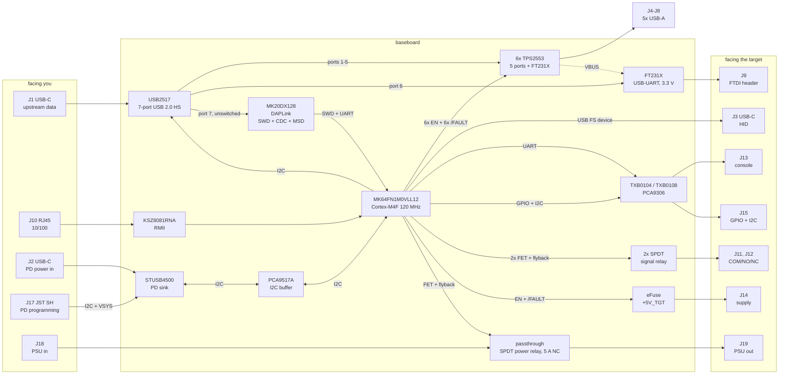

# SBC development baseboard — hardware specification

*Rev 0.1, 2026-09-12. Specification only; nothing here has been built.*

The board consolidates the hardware used to develop on and remotely manage an
attached SBC. It follows the FRDM-K64F paradigm — an application MCU with a USB
device port facing the target and a separate debug/console path facing the
developer — and extends it with switched USB port power, switched target power,
isolated relay contacts and a level-shifted target console.

---

## 1. Block diagram


*Generated by [`scripts/block-diagram.py`](../scripts/block-diagram.py), which
writes the SVG and renders the PNG, dated in the corner. **When the
configuration changes, change the script, run it, and commit all three in the
same commit as the spec.** The mermaid version below is the same topology, kept
for GitHub's inline rendering.*



Power is a separate tree; see [§4](#4-power).


Read the arrows into `SW` and `TSW` as the important ones: **port power is
switched by the MCU's own GPIO, not by the hub.** The hub's `PRTPWR` outputs
respond to the *host's* `SetPortFeature(PORT_POWER)` requests, which is the
wrong authority for a bench tool. Cutting a port has to work whether or not a
host is attached and whether or not the host agrees.

---

## 2. Connectors

| Ref | Type | Faces | Purpose |
|---|---|---|---|
| J1 | USB-C receptacle | workstation | Hub upstream data. USB 2.0 only, UFP (5.1 kΩ Rd on both CC). |
| J2 | USB-C receptacle | charger | PD sink, power in. No data. |
| J3 | USB-C receptacle | target | K64 USB FS device port — HID keyboard/mouse. UFP, **VBUS sense-only**. |
| J4–J8 | USB-A, 5× | bench | Downstream hub ports 1–5, each individually switched. |
| J9 | 6-pin 0.1″ header | target | FT231X UART on hub port 6. Standard FTDI pinout: GND, CTS, VCC, TXD, RXD, RTS/DTR. **3.3 V levels.** |
| J10 | RJ45 + magnetics + LEDs | workstation | 10/100 Ethernet. |
| J11, J12 | 3-pos pluggable 3.5 mm | target | Relay 1 and 2: COM, NO, NC. |
| J13 | 4-pos pluggable 3.5 mm | target | Console: VREF, TXD, RXD, GND. |
| J14 | 2-pos pluggable 5.08 mm | target | Switched +5V_TGT and GND. |
| J15 | 2×6 header, 2.54 mm | target | 6× level-shifted GPIO, I2C SDA/SCL, VREF, GND. |
| J16 | 10-pin Cortex debug | you | Direct SWD to the K64, bypassing DAPLink. |
| J17 | 4-pin JST SH, 1.0 mm | you | STUSB4500 NVM programming. Qwiic / STEMMA QT pinout: GND, 3.3 V, SDA, SCL. |
| J18 | 2-pos pluggable 5.08 mm | PSU | Target passthrough in: V+, GND. 0–30 VDC, 5 A. Isolated from every board net. |
| J19 | 2-pos pluggable 5.08 mm | target | Target passthrough out: V+ through the relay's NC contact, GND on the copper bus. |

Pluggable terminal blocks rather than fixed: a relay's wiring can be unplugged
as a unit and reinstalled the same way, which fixed screw terminals do not give
you. Phoenix MC 1,5/n-G-3,5 headers with MC 1,5/n-ST-3,5 plugs; MKDS 1,5/n-5,08
if you would rather have fixed terminals and do not mind rewiring.

### Why two USB-C inlets

The brief asked for one. It does not work, for a reason worth stating plainly.

A USB-C receptacle is a data role and a power role at once. The board needs to
be a **UFP** for data, because the hub's upstream port is the device side of the
link to the workstation. It also needs to be a **sink** for roughly 60 W. Those
two are individually fine — UFP + sink is what a bus-powered hub is — but the
sources differ: a 65 W PD charger presents no data at all, and a workstation
port that presents data sources 5 V at 0.9 A, or 15 W if it does PD. Neither one
alone runs five switched ports, a bridge and a target rail.

Power Role Swap could in principle ask the workstation for more, but what you
get back depends entirely on the host, which makes the board's capability a
property of whatever it is plugged into. That is not a bench tool.

So: **J1 is data, J2 is power.** The consequence is a feature rather than a
cost. With J2 alone the MCU, the relays, the PHY and the target rail are all
live, so the board can power-cycle the whole USB tree — including J1, the path
back to the workstation — and come back. A single-inlet board cannot cut its own
upstream without cutting itself.

### J9, the FTDI header

A second serial console, and a different kind from J13. J13 is owned by the
K64: level-adaptive, captured to a ring buffer, reachable over Ethernet. J9 is
an FT231X on hub port 6, so it appears on the **workstation** as a plain
`/dev/ttyUSB*` and the K64 never sees it. That is the one you want when the
thing you are debugging is the baseboard's own firmware, or when a tool insists
on a real serial device.

The pinout is the one every "FTDI header" means — the TTL-232R cable and the
SparkFun/Arduino breakouts agree on pins 1–5:

| Pin | Signal | Cable colour | Direction |
|---|---|---|---|
| 1 | GND | black | |
| 2 | CTS# | brown | into the FT231X |
| 3 | VCC | red | see below |
| 4 | TXD | orange | **out** of the FT231X — wire to the target's RX |
| 5 | RXD | yellow | **into** the FT231X — wire to the target's TX |
| 6 | RTS# / DTR# | green | out of the FT231X |

Pin 1 is silkscreened `BLK` and pin 6 `GRN`, as the breakouts do, because that
is how people actually orient the cable. TXD and RXD are named from the
FT231X's side, which is also the convention, and the silkscreen carries arrows.

**Pin 6 is a solder jumper, default DTR#.** The FTDI cable puts RTS# there; the
SparkFun breakout and the Arduino Pro Mini put DTR#, for auto-reset, and that is
the reason most boards with this header have a pin 6 at all. Either is one
`ioctl` away on the workstation, so the choice only matters when a bootloader
expects one of them.

**Pin 3 VCC is a solder jumper, default open.** The breakouts source 3.3 V or
5 V here to power a Pro Mini. On this board every path from a board rail onto
the target is a back-feed path, by the §5 rule, so it ships disconnected.
Closing the jumper connects the FT231X's own `3V3OUT`, which is limited to
50 mA — enough for a level shifter, deliberately not enough to run a board.

**It is a 3.3 V port.** `VCCIO` comes from `3V3OUT`. Connected to a 1.8 V
console, TXD drives 3.3 V into the target's RX pad. 470 Ω in series with TXD
and pin 6 holds that to a couple of milliamps through the target's clamp, so
the mistake is survivable, but it is still a mistake — **1.8 V consoles go on
J13**, which follows VREF. Open question 12 is whether pin 3 should be able to
*take* a VREF instead.

**Its VBUS goes through a TPS2553, like a port, but it is not a port.** The
bench notes record a CP2102N that stayed enumerated and openable while
delivering nothing, and was read as a dead target. The remedy was to
power-cycle its hub port. The FT231X is a better chip, and the failure is not
specific to a chip. So its VBUS is switchable — `FTDI CYCLE` — but under its
own verb, **outside the `PORT ALL` sweep**, booting on. The thing you are
reading the boot log on cannot be swept away.

Hub ports 6 and 7 are flagged non-removable in the USB2517's configuration,
which is what they are. Two LEDs on the FT231X's CBUS pins show TX and RX
activity at the header. TVS on all four signals; the header will be hot-plugged.

---

## 3. Part selection

| Block | Part | Notes |
|---|---|---|
| Application MCU | **MK64FN1M0VLL12** | 100-LQFP, Cortex-M4F 120 MHz, 1 MB flash, 256 KB SRAM, USB FS OTG, 10/100 MAC. Same die as the FRDM-K64F, whose schematic is public and serves as the reference design. |
| Ethernet PHY | **KSZ8081RNA** | RMII, same part as the FRDM, so the Zephyr devicetree carries over. The `RNA` and `RND` suffixes differ in how the PHY is clocked (50 MHz reference in vs 25 MHz crystal) and are **not** interchangeable — confirm which one the FRDM fits and which one this clock tree wants, against the datasheet, at BOM time. See [open question 2](#8-open-questions). |
| Debug/console MCU | **MK20DX128VFM5** running DAPLink | CMSIS-DAP SWD + USB CDC + mass-storage drag-drop, exactly as OpenSDA v2 does today. |
| USB hub | **USB2517** (or USB2517i) | 7-port USB 2.0 HS. Ports 1–5 to the USB-A connectors, port 6 to the FT231X, port 7 to the DAPLink; 6 and 7 flagged non-removable. I2C/SMBus configuration, 24 MHz crystal. |
| Port switches, 6× | **TPS2553** | Five USB-A ports and the FT231X's VBUS. Adjustable current limit via `ILIM`, soft-start, open-drain `/FAULT`. |
| USB-UART bridge | **FT231XS** | SSOP-20 (`FT231XQ` for QFN). Bus-powered from hub port 6; `3V3OUT` feeds `VCCIO`. CBUS0/1 drive TX/RX LEDs. |
| FTDI header | 6-pin 0.1″, right-angle, board edge | J9. Two solder jumpers: pin 6 RTS#/DTR#, pin 3 VCC. 470 Ω series on TXD and pin 6. |
| Target rail switch | eFuse or load switch, ≥5 A | Adjustable limit, `/FAULT` back to the MCU. Candidate: TPS25940 family. |
| PD sink | **STUSB4500** | Autonomous — negotiates from NVM-stored PDOs with no MCU involvement, so the board is powered before firmware runs. I2C readback lets the MCU learn the contract. Alternate: Infineon CYPD3177. |
| PD programming header | **JST SM04B-SRSS-TB** | The Qwiic / STEMMA QT connector, side entry; `BM04B-SRSS-TB` if placement wants top entry. Stock cables fit either. |
| PD bus buffer | **PCA9517A** | Isolates the K64 from the PD sink's I2C whenever the board is unpowered or a programmer is on J17. See §4. |
| Relays, 2× | **Omron G6K-1F-Y**, 5 V coil | 1 Form C (SPDT), gold-clad contacts, 1 A / 30 VDC, ~30 mA coil. |
| Power relay | SPDT, **NC contact ≥5 A at 30 VDC** | Candidates: Omron G5LE-1, G2R-1, Panasonic JW1FSN; 5 V coil, ~80 mA, AgSnO2 contacts. **Read the NC figure specifically** — see §4. |
| Relay drivers, 3× | AO3400 + 1N4148 flyback | One FET for all three coils. Gate pulldown to ground — see §5. |
| PSU presence detect | LTV-817-class optocoupler | Optional. The only component that touches the passthrough, across an isolation barrier — see §4. |
| UART translation | **TXB0104** | Auto-direction, push-pull. `VCCA` from J13's VREF pin. |
| I2C translation | **PCA9306** | Open-drain pass-through. **Do not** use a TXB part for I2C. |
| GPIO translation | **TXB0108** | Same VREF as the console. |
| ESD | USBLC6-2SC6 or TPD2E2U06 per USB pair | Plus TVS on the screw-terminal nets. |

### Two notes on parts that are easy to get wrong

**Relay contact material.** The two relays exist to short things like
FORCE_RECOVERY to ground — a *dry circuit*, microamps at 1.8 V. Silver contacts
on a general-purpose power relay develop a sulphide film that needs tens of
volts or hundreds of milliamps to break down, so such a relay can read as closed
on a multimeter and still not pull a logic pin low. Gold-clad contacts on a
signal relay are specified for exactly this. The ceiling is then 1 A, which is
why target power is a separate switched rail rather than a third relay.

**TXB parts are push-pull only.** A TXB0104 or TXB0108 has weak (~4 kΩ) one-shot
assisted drivers and will fight any external pull-up below about 50 kΩ; on an
open-drain net it simply does not work. The console is push-pull, so TXB is
right there; I2C is open-drain, so it gets a PCA9306. The GPIO breakout is TXB,
which means **the header's pins are push-pull and must not be used as
open-drain** — document that on the silkscreen.

---

## 4. Power

### Tree

```
J2 ──> STUSB4500 ──> VBUS_IN (5-20 V) ──┬──> buck 1 ──> +5V_PORTS ──┬──> 5x TPS2553 ──> J4-J8
        reverse-polarity + OVP          │                            ├──> 1x TPS2553 ──> FT231X
                                        │                            ├──> relay coils
                                        │                            └──> buck 3 ──> +3V3
                                        └──> buck 2 ──> +5V_TGT ──> switch ──> J14
```

Two separate 5 V bucks, not one. A target's inrush at power-on is large and
poorly characterised — you do not know what is on the other end of J14 — and if
it shares a rail with the hub ports, that inrush browns out every attached
device including the console adapter you are watching the boot on. Separating
them costs one converter and removes a whole class of confusing failure.

`+3V3` hangs off `+5V_PORTS` rather than `VBUS_IN` so the logic supply sees a
pre-regulated input and a narrow conversion ratio.

The target passthrough (J18 → J19) is deliberately absent from this tree. It is
not a board rail and draws nothing from the PD contract; see below.

### Budget

| Rail | Load | Typical | Worst case |
|---|---|---|---|
| +5V_PORTS | 5× USB-A | 5 × 0.5 A = 2.5 A | 5 × 1.0 A = 5.0 A |
| | FT231X, and J9 VCC if jumpered | 10 mA | 60 mA |
| | 3× relay coil | 140 mA | 140 mA |
| +5V_TGT | target SBC | 2.0 A | 5.0 A |
| +3V3 | K64 ~100 mA, KSZ8081 ~60 mA, USB2517 ~250 mA, DAPLink ~30 mA, translators ~20 mA | 0.30 A | 0.50 A |
| **Total at 5 V** | | **≈5.0 A (25 W)** | **≈10.7 A (54 W)** |

With conversion losses, worst case draws roughly 62 W at the inlet. So:

- **20 V / 5 A (100 W)** — full worst case with headroom.
- **20 V / 3 A or 15 V / 3 A (60 W / 45 W)** — the realistic common case, and
  enough for typical load, but **not** enough for every port at its limit plus a
  5 A target.
- **5 V / 3 A (15 W)** — degraded. Board runs, MCU and Ethernet and relays are
  fine, but ports must be budgeted tightly.

Which means the MCU has to know the contract. `STUSB4500` reports the negotiated
RDO over I2C, so firmware reads it at boot and **refuses to enable more load
than the contract supports**, reporting `ERR POWER BUDGET` rather than browning
out the rail and dropping every device at once. This is the single most
load-bearing argument for the MCU owning port power rather than the hub: the hub
has no idea what the inlet negotiated.

Per-port limit is set to ~1.1 A by the `ILIM` resistor: a 500 mA device plus
inrush headroom, and well under what a single port could otherwise pull from a
shared rail.

### Programming the PD sink

The STUSB4500 negotiates from PDOs stored in its NVM, and the NVM is written
over I2C. Rather than depend on K64 firmware for that, J17 brings the sink's
I2C out on a 4-pin 1.0 mm JST — the Qwiic / STEMMA QT footprint, pinned to that
standard: **1 GND, 2 3.3 V, 3 SDA, 4 SCL** (black, red, blue, yellow on the
stock cables). Any Qwiic-equipped dev board running SparkFun's STUSB4500 library
programs it, as does ST's own tool.

The connector is nothing. What it has to survive is this: if the NVM is ever
written badly enough that the sink stops attaching, VBUS never arrives, the
board never powers, and nothing on the board can fix the NVM. That is a bricked
board unless the sink can be powered from somewhere other than the charger.

So the header's 3.3 V pin feeds the STUSB4500's `VSYS` — its optional external
supply — and **nothing else**. Not the board's +3V3 rail. The sink then runs
from the programmer alone, with no charger attached and the bucks dark, and the
programmer's 3.3 V never back-drives a rail. A 100 kΩ pull-down holds `VSYS` at
0 V when nothing is plugged in.

That creates the second problem. The K64 also has to reach the STUSB4500, to
read the negotiated contract. With the board unpowered and a programmer
attached, a dead K64 on the same bus clamps SDA and SCL through its protection
diodes, and pull-ups to a dead +3V3 rail are pull-downs. With the board powered,
a programmer and the K64 are two masters on one bus with nothing arbitrating.

Both go away with one part: a **PCA9517A** I2C buffer between the board bus
(K64, hub) and the PD segment (STUSB4500, J17).

- The PD segment's pull-ups, and the buffer's B side and `EN` pull-up, go to
  `+3V3_PD`: a BAT54C diode-OR of board +3V3 and header VCC, live from
  whichever is present.
- The buffer isolates its two sides whenever `EN` is low. Header VCC drives a
  2N7002 that pulls `EN` low, so **a programmer on J17 disconnects the K64 in
  hardware**. No multi-master case, and nothing for firmware to get right.
- With the board unpowered, `+3V3_PD` comes only from the programmer, whose
  presence is what pulls `EN` low — so the two cases that need isolation are
  the two cases that get it.
- Header VCC also reaches a K64 GPIO, `PD_PROG_DET`, through 100 kΩ — so
  firmware knows why it cannot see the sink and says so, and a programmer on
  a dead board pushes microamps into the K64, not milliamps.

A TVS array on SDA/SCL, since the header will be hot-plugged, and 1 µF on
`VSYS`.

The minimum alternative is a 2-pin jumper that disconnects the K64. It saves
one IC and it is the kind of thing this bench has been removing: a step a human
has to remember, whose failure mode looks like a broken bus.

### Target passthrough

Not every target runs from 5 V. An Xavier AGX ships with a 19 V / 3 A supply,
and the board's own +5V_TGT rail — inside the PD budget, behind a 5 A eFuse — is
the wrong tool for it. So J18 and J19 pass an external PSU straight through,
the board's only involvement being one relay contact in the high side.

```
J18 (PSU in)   V+  ──> relay COM ── NC ──> V+   J19 (target out)
               GND ──> copper bus, ≥5 mm, both outer layers ──> GND
```

**The passthrough nets are independent of every board net.** Not the ground
plane, not any rail. The relay's coil is on the board; its contacts are not.
Three reasons, all of which matter at 19 V / 3 A:

- The board is not in the PSU's return path. 3 A does not flow through the
  ground plane, out through the USB shields to the workstation, or down the
  console cable's GND.
- Any PSU can be attached — 5 to 30 V, either polarity, floating or
  earth-referenced — and the board neither knows nor cares.
- A fault on the target's supply side cannot reach the board's logic.

The target's ground still meets the board's through J3 and J13, as it would on
any bench. The point is that the *power* current does not.

**NC, not NO.** The relay is de-energized in the passing state. This is the §5
rule — a rail boots to the state that does no harm, set by hardware — taken one
step further: a baseboard that has lost its own power, or has been unplugged
entirely, still passes the PSU through. The only way to cut the target is to
energize the coil, and a coil cannot energize by accident.

The cost is the mirror image: with the baseboard unpowered, the target *cannot*
be cut. That is the right way round for a development bench.

**The NC rating is the selection criterion, and it is easy to get wrong.** SPDT
power relays are commonly rated on the NO contact — the "10 A" on the front of
the datasheet — with the NC contact derated to 3 or 5 A in a table further in.
Candidates that advertise 10 A can fail 5 A on NC. Read the NC figure, at 30 VDC
resistive, before choosing. Prefer AgSnO2 contacts: an SBC's input is a bank of
bulk capacitance, so the contact closes into an inrush of tens of amps for
microseconds, which AgSnO2 tolerates and AgNi pits under. Resistive and
capacitive loads are assumed and no snubber is fitted, so an inductive load on
J19 needs its own.

**Copper.** 5 A continuous at a 10 °C rise wants about 2.7 mm of 1 oz outer
copper by IPC-2221. Use ≥5 mm on both outer layers, via-stitched, for GND and
for the V+ runs to and from the relay, and keep J18, the relay and J19 within a
few centimetres of one another so those runs are short. The relay's contact pins
get solid pads, no thermal relief. Keep ≥1 mm from every board net, so the
isolation is visible in the layout and not only in the netlist.

**Presence detect, optional, fitted by default.** An optocoupler across J18: LED
in series with a resistor sized to stay within limits from 5 to 30 V (split for
dissipation), an antiparallel diode so a reversed PSU does no harm, transistor
side on a K64 GPIO. That gives `psu=present` in `STATE` without breaking the
isolation, and it is the only component on the board that touches the
passthrough at all. It is the difference between "the target is not booting"
and "the PSU is not plugged in".

### Open item

Buck 1 feeds five ports, the FT231X, the relay coils and buck 3, from a
4.5–21 V input: about 5.7 A continuous with ports limited at 1.0 A, 6.2 A at
1.1 A. A 6 A part (LM61460 class) now fits at 1.0 A and is marginal at 1.1 A —
the FT231X taking port 6 made this easier, not moot. **Resolve the per-port
limit before schematic capture** — it is the one number that changes the power
section's topology.

---

## 5. Safe states

Every rail's state while the MCU is in reset is set by a resistor, not by
firmware, because K64 GPIO are inputs at reset and stay that way until code
runs. Choose each switch's enable polarity so the passive state is the safe one.

| Load | State in reset | Set by | Why |
|---|---|---|---|
| J4–J8 USB-A ports, FT231X | **ON** | pull-up on active-high `EN` | Never silently drop power. A watchdog reset must not disconnect the console adapter you are reading the target's boot log on — which on this board may be the FT231X itself. |
| +5V_TGT | **ON** | pull-up on `EN` | Same. Resetting the baseboard must not reset the target. |
| Relay 1, 2 | **DE-ENERGIZED** | 100 kΩ gate pulldown | A relay that energizes at boot asserts FORCE_RECOVERY on every reset of the controller. Which way that fails is the installer's choice — SPDT gives both NO and NC on the terminal block. |
| Passthrough relay | **PASSING** (de-energized, NC closed) | 100 kΩ gate pulldown, and the relay itself | A baseboard that has lost its own power still passes the PSU through. Cutting the target takes an energized coil, which cannot happen by accident. |

This is carried straight from the relay controller, where the two firmware
profiles boot opposite ways for exactly these reasons, and where a unit test
asserts each one.

Two matching firmware rules:

1. **Write the output register before enabling the driver.** On K64, `PDOR`
   before `PDDR`. Reversing them drives the pin's reset value for as long as it
   takes to reach the next instruction, which is enough to click a relay.
2. **The relay pins are never configured as anything but GPIO outputs.** No
   alternate-function pin shared with a peripheral that might drive it.

### Back-feed

The failure to design out: a self-powered board pushing 5 V up its own device
port into the target, so cutting the target's power leaves it half-alive. On the
current bench this takes 90 seconds to decay, the console goes silent, and the
whole thing reads as a dead module rather than a power problem. `jetson-power.py`
works around it in software by cutting the back-feed port first.

Here it is a hardware rule: **J3's VBUS is an input only.** A >100 kΩ divider for
presence detection, and if the K64's `VREGIN` is fed from it at all, through a
blocking element. No path from any board rail onto J3's VBUS, on any layer.

That removes the VBUS path entirely. What remains is the 1.5 kΩ D+ pull-up,
which can trickle a milliamp or so into the target's PHY rail — orders of
magnitude below what holds an SBC alive, and not worth a data mux to fix.

---

## 6. Pin budget

100-LQFP, checked against function so that pin count does not become a surprise
during capture.

| Function | Pins |
|---|---|
| RMII to PHY — TXD0/1, TXEN, RXD0/1, RXER, CRS_DV, MDIO, MDC | 9 |
| RMII 50 MHz reference | 1 |
| USB FS device — DP, DM, VREGIN, VOUT33 | 4 (dedicated) |
| Port power — 5× EN, 5× /FAULT | 10 |
| FT231X power — EN, /FAULT | 2 |
| Target power — EN, /FAULT | 2 |
| Relays — 3× gate | 3 |
| PSU presence — optocoupler | 1 |
| Target UART — TXD, RXD | 2 |
| DAPLink CDC UART — TXD, RXD | 2 |
| I2C — hub, PD sink (shared bus) | 2 |
| I2C — target breakout (separate bus) | 2 |
| GPIO breakout | 6 |
| Hub `RESET_N`, PD `ATTACH`/alert | 2 |
| `PD_PROG_DET` — programmer on J17 | 1 |
| SWD — SWCLK, SWDIO, `RESET_b` | 3 |
| Status — RGB heartbeat, 5× port LED, 3× relay LED | 11 |
| **Total signal** | **63** |

Comfortable in a 100-LQFP after power and analogue pins. Two things to note: the
target's I2C is a **separate bus** from the hub and PD controller's, because a
target that hangs SDA low must not take out the board's own configuration path;
and the port LEDs can move behind a shift register if layout wants the pins
back, since their timing does not matter.

---

## 7. Firmware

Zephyr, extending `frdm-k64f-hid`. That application already splits its command
layer from its transport — it takes a line and a reply function — so the
Ethernet listener is an addition rather than a rewrite.

Three transports, one parser:

| Transport | Path | For |
|---|---|---|
| USB CDC | DAPLink on hub port 7 → J1 | Local work, bring-up, and whenever the network is the thing that is broken |
| TCP | Ethernet → J10 | Remote management, the normal case |
| SWD | DAPLink → J16 | Debugging the baseboard itself |

J9 is not a transport. It reaches the workstation through the hub and the K64
cannot see it; the only thing firmware does with it is power-cycle it.

Protocol in **[protocol.md](protocol.md)**. It keeps the `OK`/`ERR` single-line
convention both existing firmwares use, and the persistent `SETID` identity from
the relay controller — several of these will share a workstation, and a script
that picks the wrong board cuts power to the wrong machine.

The RGB heartbeat from the QT Py carries over: a glance at the board says the
firmware is running and its loop is not wedged.

---

## 8. Open questions

| # | Question | Blocks |
|---|---|---|
| 1 | Per-port current limit — 0.75 A or 1.1 A? | Buck 1 selection, §4 |
| 2 | Verify the FRDM-K64F clocking: one 50 MHz oscillator into both K64 `EXTAL0` and PHY `XI`? Read it off the rev E schematic, do not assume. | Clock tree |
| 3 | DAPLink board ID and MSD volume name. A custom DAPLink build can name the volume anything; `frdm-k64f-hid/scripts/flash.sh` already reads `LABEL=${MBED_LABEL:-MBED}`, so agreeing with it is one environment variable rather than a change. Decide the name. | Firmware tooling |
| 4 | USB VID/PID. `frdm-k64f-hid` currently ships `2fe3:0001`, which is **the Zephyr project's VID** and was already flagged as unshippable. This board needs its own, and now has a hub and a DAPLink wanting identifiers too. | Anything leaving the lab |
| 5 | K64 lead time. If it is bad, the fallback is an RP2350 + W5500, which costs the Zephyr board port and the FRDM tooling. | BOM |
| 6 | ~~Does J14 need a raw `VBUS_IN` pass-through for 12 V targets?~~ **Resolved** by J18/J19: any PSU passes through, isolated. J14 stays for 5 V targets that want to live inside the PD budget without a PSU of their own. | — |
| 7 | Form factor and mounting. Standalone with a mounting pattern, or does it want to sit under a specific carrier? | Layout |
| 8 | Authentication on the TCP transport. Today anything that can reach the port can cut the target's power and assert its recovery pins. A trusted segment is the assumption; decide whether that is good enough. | Remote management outside the lab |
| 9 | Should the K64 be able to rewrite the STUSB4500 NVM itself, over the buffered bus? Then J17 is bring-up and recovery only, and PDO changes become a console command. | Firmware scope |
| 10 | Verify at bring-up, against the datasheets: the STUSB4500 runs and answers I2C from `VSYS` alone with no VBUS; what it asks of an unused `VSYS`; and the PCA9517A's B side with `VCCA` at 0 V. The J17 circuit assumes all three. | J17 circuit |
| 11 | Power relay: confirm on the chosen part's datasheet that the **NC** contact is rated ≥5 A at 30 VDC resistive, and the contact material. The headline figure is usually NO. | J18/J19 |
| 12 | J9 pin 3: a third jumper position that makes it a VREF *input* feeding the FT231X's `VCCIO`, so the header follows a 1.8 V target. Needs the FT231X's behaviour with `VCCIO` at 0 V (target off) verified first; J13 already covers 1.8 V, so this is convenience, not capability. | J9 |

Item 4 is the one that is easy to defer and expensive to defer — a VID has lead
time of its own.
